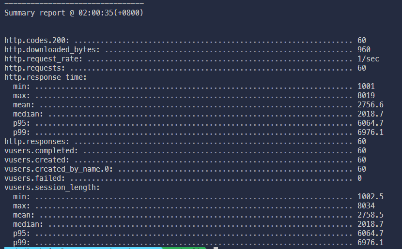

# Backend Test - Technical Assessment

## Installation

To install the necessary dependencies, run the following command at the root directory:

```
npm install
```

## Dependencies

- `express` - For creating web server
- `artillery` - Load testing toolkit for assessing application and API performance. Installed globally to enable execution of the `artillery` command on the command line.

## Question 1

The code in `/question1` directory represents the solution for Question 1.

### How to Run

Navigate to the root directory and execute the following command to run the code for Question 1:

```
node question1/index.js
```

## Question 2

The code in `/question2` directory represents the solution for Question 2.

### Available Endpoints

- `/generate-unique-256-hash` - Generates a unique SHA-256 hash string.
- `/find-odd-ending-hash`- Requests a hash string from the `/generate-unique-256-hash` endpoint until it finds a hash where the last character is an odd number.

### How to run

1. Start the server for Question 2 by running `node question2/index.js`
2. Use your preferred methods (e.g. open in browser or tools like Postman) to interact with the endpoints

### Load Testing

For load testing, ensure Artillery is installed globally. If not installed, run `npm install -g artillery`

To perform load testing, execute the following command at the root directory:

```
artillery run question2/loadtesting.yaml

```

This command executes the load testing script defined in question2/loadtesting.yaml.

Here is the sample load test summary:


